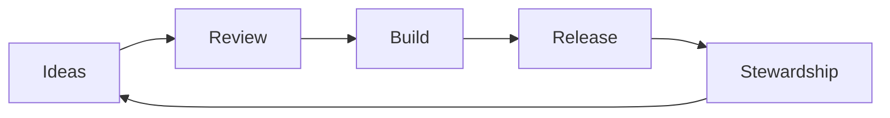

  

<h1 align="center">Zacro Technologies</h1>

<em>Building the foundations for a self-sustaining community network, starting with AI.</em>

  <a href="https://zacro.tech">zacro.tech</a> • <a href="https://zacro.tech/ai"> Zacro AI</a>

## :compass: Mission

Create a community where people can live well through contribution, not money — powered by fair, transparent technology.

## :memo: Mission Statements

- Build the AI backbone for a community-first economy.
- Reward real contributions with access to essential services.
- Grow trust through open governance and shared stewardship.

## :sparkles: Vision

A self-sustaining network that provides essential services (AI, internet, electricity, food, and more) through shared contribution and mutual care — no tax, no money, no crypto. Just fairness, friendship, and meaningful work.

## :rocket: Current Focus

- :robot: Reliable, human-centered AI infrastructure
- :repeat: Community credits for access to AI services
- :balance_scale: Transparent governance and oversight

## :shield: Principles

- Fairness is a feature
- Transparency by default
- Security over hype
- Stewardship over extraction
- Simple systems, clear rules

## :telescope: North Star

As AGI arrives, people should be free to pursue meaningful work and still live well. Our goal is a contribution-based economy where service access is granted fairly and dynamically, based on real community needs.

## :sparkler: How Credits Work (Early Phase)

- Credits are earned through verified contributions to the network.
- Credits are used to access services (AI first, more later).
- Credit requirements and rewards adjust with demand and supply.
- Credits are non-monetary, non-transferable, and not for speculation.

## :white_check_mark: Contribution Rules

- Contributions must be measurable and tied to real impact.
- Reviews are transparent, with clear criteria and public rationale.
- Abuse, gaming, or exploitation results in revocation.
- Disputes are handled through open, community-led appeals.

## :scroll: Policies

- Consent and privacy are non-negotiable.
- Safety is prioritized over growth.
- Governance changes require community review and public notice.
- Credits never represent money, equity, or ownership.

## :people_holding_hands: Community

We welcome builders, researchers, designers, and advocates.

- Propose ideas and experiments
- Contribute to docs and code
- Join governance discussions

## :bar_chart: Community Loop

## :package: Repositories

- https://github.com/Zacro-Technologies/zacro.tech
- https://github.com/Zacro-Technologies

## :triangular_ruler: Signal Board

| Now                  | Next             | Later                 |
| -------------------- | ---------------- | --------------------- |
| Governance clarity   | Credit policy v1 | Multi-service pilots  |
| Documentation polish | Public roadmap   | Community autonomy    |

## :scroll: Governance

Read the governance overview on the Zacro AI site.
