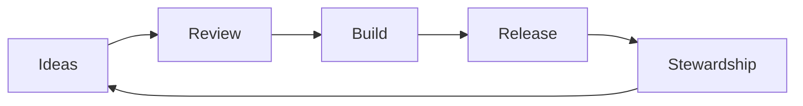

  
  

<h1 align="center">Zacro Technologies</h1>

<em>Community-first studio building fair, transparent AI for the next decade.</em>

  <a href="https://zacro.tech">zacro.tech</a> • <a href="https://zacro.tech/ai">Zacro AI</a>

## :compass: Mission

Make advanced technology feel human: open, accountable, and accessible.

## :sparkles: Focus

- :robot: Responsible AI systems
- :balance_scale: Governance and oversight tooling
- :link: Open standards and shared infrastructure

## :shield: Principles

- Fairness is a feature
- Transparency by default
- Security over hype
- Community stewardship
- Minimalism in design and code

## :people_holding_hands: Community

We welcome builders, researchers, designers, and advocates.

- Propose ideas and experiments
- Contribute to docs and code
- Join governance discussions

## :bar_chart: Community Loop

## :package: Repositories

- https://github.com/Zacro-Technologies/zacro.tech
- https://github.com/Zacro-Technologies

## :triangular_ruler: Signal Board

| Now                  | Next             | Later                 |
| -------------------- | ---------------- | --------------------- |
| Governance clarity   | Open tooling     | Shared standards      |
| Documentation polish | Community pilots | Long-term stewardship |

## :scroll: Governance

Read the governance overview on the Zacro AI site.
